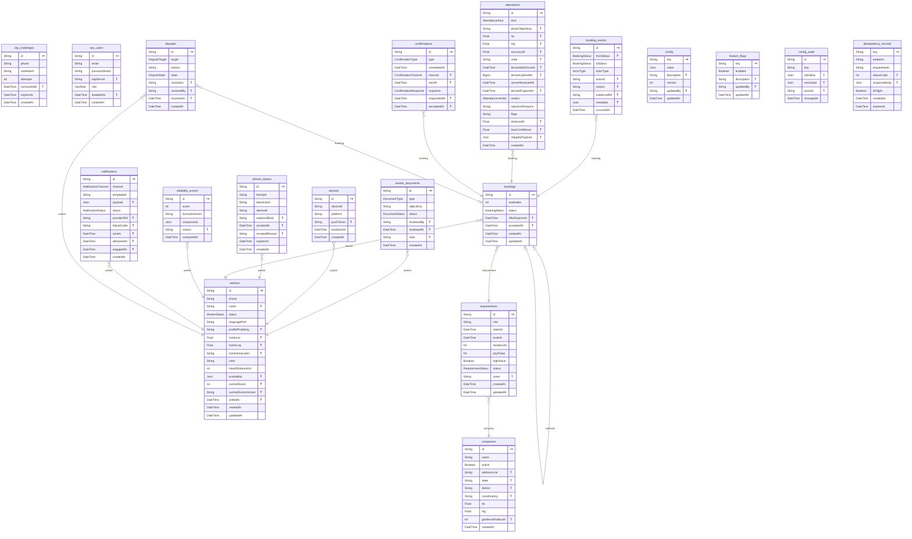

```mermaid
erDiagram

  "workers" {
    String id "🗝️"
    String phone 
    String name "❓"
    WorkerStatus status 
    String languagePref 
    String profilePhotoKey "❓"
    Float homeLat "❓"
    Float homeLng "❓"
    String homeAreaLabel "❓"
    String roles 
    Int travelDistanceKm 
    Json availability "❓"
    Int cachedScore "❓"
    String cachedScoreVersion "❓"
    DateTime vettedAt "❓"
    DateTime createdAt 
    DateTime updatedAt 
    }
  

  "worker_documents" {
    String id "🗝️"
    DocumentType type 
    String objectKey 
    DocumentStatus status 
    String reviewedBy "❓"
    DateTime reviewedAt "❓"
    String note "❓"
    DateTime createdAt 
    }
  

  "devices" {
    String id "🗝️"
    String deviceId 
    String platform 
    String pushToken "❓"
    DateTime lastSeenAt 
    DateTime createdAt 
    }
  

  "otp_challenges" {
    String id "🗝️"
    String phone 
    String codeHash 
    Int attempts 
    DateTime consumedAt "❓"
    DateTime expiresAt 
    DateTime createdAt 
    }
  

  "refresh_tokens" {
    String id "🗝️"
    String familyId 
    String tokenHash 
    String deviceId 
    String replacedById "❓"
    DateTime revokedAt "❓"
    String revokedReason "❓"
    DateTime expiresAt 
    DateTime createdAt 
    }
  

  "ops_users" {
    String id "🗝️"
    String email 
    String passwordHash 
    String totpSecret "❓"
    OpsRole role 
    DateTime disabledAt "❓"
    DateTime createdAt 
    }
  

  "companies" {
    String id "🗝️"
    String name 
    Boolean active 
    String addressLine "❓"
    String state "❓"
    String district "❓"
    String constituency "❓"
    Float lat 
    Float lng 
    Int geofenceRadiusM "❓"
    DateTime createdAt 
    }
  

  "requirements" {
    String id "🗝️"
    String role 
    DateTime startsAt 
    DateTime endsAt 
    Int headcount 
    Int payPaise 
    Boolean highValue 
    RequirementStatus status 
    String notes "❓"
    DateTime createdAt 
    DateTime updatedAt 
    }
  

  "bookings" {
    String id "🗝️"
    Int seatIndex 
    BookingStatus status 
    DateTime offerExpiresAt "❓"
    DateTime acceptedAt "❓"
    DateTime createdAt 
    DateTime updatedAt 
    }
  

  "booking_events" {
    String id "🗝️"
    BookingStatus fromStatus "❓"
    BookingStatus toStatus 
    ActorType actorType 
    String actorId "❓"
    String reason "❓"
    String evidenceRef "❓"
    Json metadata "❓"
    DateTime occurredAt 
    }
  

  "attendance" {
    String id "🗝️"
    AttendanceKind kind 
    String photoObjectKey "❓"
    Float lat "❓"
    Float lng "❓"
    Float accuracyM "❓"
    String code "❓"
    DateTime deviceWallClockAt "❓"
    BigInt deviceUptimeMs "❓"
    DateTime serverReceivedAt 
    DateTime derivedCaptureAt "❓"
    AttendanceVerdict verdict 
    String rejectionReasons 
    String flags 
    Float distanceM "❓"
    Float faceConfidence "❓"
    Json integrityPayload "❓"
    DateTime createdAt 
    }
  

  "confirmations" {
    String id "🗝️"
    ConfirmationType type 
    DateTime scheduledAt 
    ConfirmationChannel channel "❓"
    DateTime sentAt "❓"
    ConfirmationResponse response 
    DateTime respondedAt "❓"
    DateTime escalatedAt "❓"
    }
  

  "reliability_scores" {
    String id "🗝️"
    Int score 
    String formulaVersion 
    Json components 
    String reason "❓"
    DateTime computedAt 
    }
  

  "notifications" {
    String id "🗝️"
    NotificationChannel channel 
    String templateId 
    Json payload "❓"
    NotificationStatus status 
    String providerRef "❓"
    String failureCode "❓"
    DateTime sentAt "❓"
    DateTime deliveredAt "❓"
    DateTime engagedAt "❓"
    DateTime createdAt 
    }
  

  "disputes" {
    String id "🗝️"
    DisputeTarget target 
    String reason 
    DisputeState state 
    String resolution "❓"
    String resolvedBy "❓"
    DateTime resolvedAt "❓"
    DateTime createdAt 
    }
  

  "config" {
    String key "🗝️"
    Json value 
    String description "❓"
    Int version 
    String updatedBy "❓"
    DateTime updatedAt 
    }
  

  "feature_flags" {
    String key "🗝️"
    Boolean enabled 
    String description "❓"
    String updatedBy "❓"
    DateTime updatedAt 
    }
  

  "config_audit" {
    String id "🗝️"
    String key 
    Json oldValue "❓"
    Json newValue "❓"
    String actorId "❓"
    DateTime changedAt 
    }
  

  "idempotency_records" {
    String key "🗝️"
    String endpoint 
    String requestHash 
    Int statusCode "❓"
    Json responseBody "❓"
    Boolean inFlight 
    DateTime createdAt 
    DateTime expiresAt 
    }
  
    "worker_documents" }o--|| "workers" : "worker"
    "devices" }o--|| "workers" : "worker"
    "refresh_tokens" }o--|| "workers" : "worker"
    "requirements" }o--|| "companies" : "company"
    "bookings" }o--|| "requirements" : "requirement"
    "bookings" }o--|| "workers" : "worker"
    "bookings" |o--|o "bookings" : "replaces"
    "booking_events" }o--|| "bookings" : "booking"
    "attendance" }o--|| "bookings" : "booking"
    "confirmations" }o--|| "bookings" : "booking"
    "reliability_scores" }o--|| "workers" : "worker"
    "notifications" }o--|| "workers" : "worker"
    "disputes" }o--|| "workers" : "worker"
    "disputes" }o--|o "bookings" : "booking"
```
